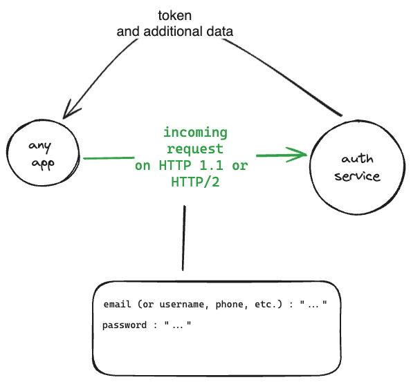
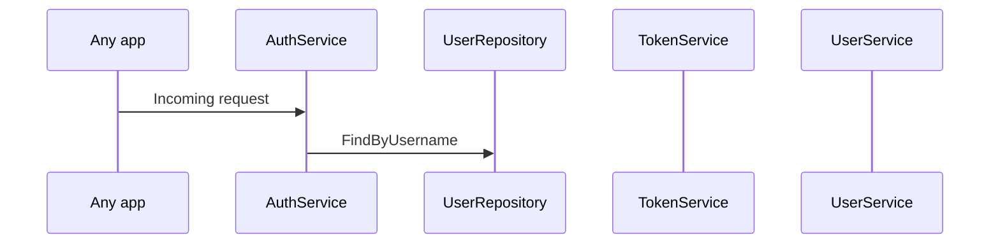

# Reusable Auth Service

Generic сервис, выполняющий идентификацию, аутентификацию и авторизацию пользователей.

## Идея

Создать самостоятельный сервис, который можно встраивать в любой проект, преимущественно в проекты на микросервисной архитектуре.

Допускается возможность развертывания как отдельного микросервиса, так и возможность
встраивания в другой микросервис.

